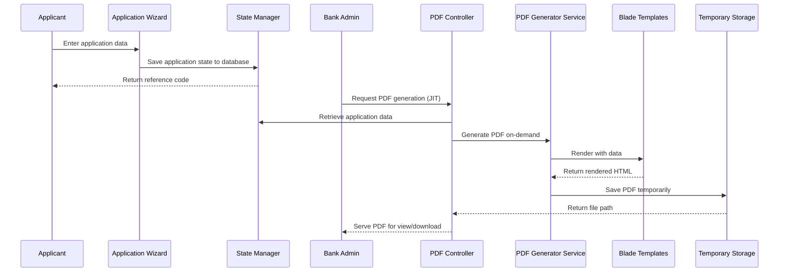
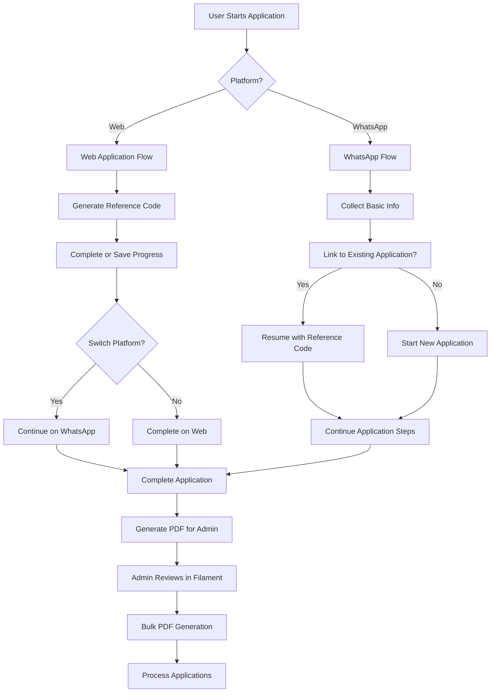

# Design Document: PDF Form Enhancement

## Overview

This design document outlines the approach for enhancing the application's PDF form generation capabilities. The goal is to ensure that all applicant data is accurately captured during the application wizard flow and stored in the database. PDFs will be generated Just-In-Time (JIT) when bank staff request them through the admin interface, ensuring that the generated PDFs match the design templates in the `/public/design` directory. Additionally, the system will provide applicants with reference codes to track their applications and resume them via WhatsApp, while giving bank staff a robust admin interface to manage applications and generate PDFs on-demand, either individually or in bulk.

## Architecture

The PDF form generation system follows a layered architecture:

1. **Presentation Layer**: The application wizard UI components that collect user data
2. **State Management Layer**: Stores and manages application state throughout the wizard flow
3. **Service Layer**: Handles the business logic for PDF generation
4. **Template Layer**: Contains the Blade templates for rendering PDFs
5. **Storage Layer**: Manages the storage and retrieval of generated PDFs
6. **Integration Layer**: Connects with WhatsApp API for continuing applications
7. **Admin Layer**: Filament-based admin interface for bank staff

The flow of data through these layers is as follows:



## Components and Interfaces

### 1. ApplicationWizardController

Responsible for managing the application wizard flow and collecting user data.

```php
class ApplicationWizardController
{
    public function show(Request $request): Response;
    public function resume(Request $request, string $identifier): Response;
    public function status(): Response;
    public function tracking(): Response;
    public function generateReferenceCode(string $sessionId): string;
}
```

### 2. ApplicationPDFController

Handles PDF-related operations including viewing, downloading, and regenerating PDFs.

```php
class ApplicationPDFController
{
    public function download(Request $request, string $sessionId);
    public function view(Request $request, string $sessionId);
    public function regenerate(Request $request, string $sessionId);
    public function batchDownload(Request $request);
}
```

### 3. PDFGeneratorService

Core service responsible for generating PDFs from application data.

```php
class PDFGeneratorService
{
    public function generateApplicationPDF(ApplicationState $applicationState): string;
    public function generateBatchPDFs(array $sessionIds): array;
    private function determineTemplate(string $employer, bool $hasAccount): string;
    private function preparePDFData(ApplicationState $applicationState): array;
    private function generateApplicationNumber(ApplicationState $applicationState): string;
    private function generateFilename(ApplicationState $applicationState): string;
}
```

### 4. StateManager

Manages the application state throughout the wizard flow.

```php
class StateManager
{
    public function saveState(string $sessionId, string $step, array $data): void;
    public function getState(string $sessionId): ?ApplicationState;
    public function getStateByResumeCode(string $resumeCode): ?ApplicationState;
    public function generateSessionId(): string;
}
```

### 5. Blade Templates

Four main templates for different application types:
- `account_holders_pdf.blade.php`
- `sme_account_opening_pdf.blade.php`
- `ssb_form_pdf.blade.php`
- `zb_account_opening_pdf.blade.php`

## Data Models

### ApplicationState Model

```php
class ApplicationState extends Model
{
    protected $fillable = [
        'session_id',
        'resume_code',
        'current_step',
        'form_data',
        'expires_at',
    ];

    protected $casts = [
        'form_data' => 'array',
        'expires_at' => 'datetime',
    ];
}
```

### WizardData Interface (TypeScript)

```typescript
interface WizardData {
    language?: string;
    intent?: string;
    employer?: string;
    employerCategory?: string;
    
    // Product selection data
    category?: string;
    subcategory?: string;
    business?: string;
    scale?: string;
    amount?: number;
    creditTerm?: number;
    monthlyPayment?: number;
    
    // Account verification
    hasAccount?: boolean;
    accountDetails?: any;
    
    // Form data
    formId?: string;
    formResponses?: any;
    
    // Document data
    documents?: {
        uploadedDocuments: Record<string, any[]>;
        selfie: string;
        signature: string;
        uploadedAt: string;
    };
    
    // PDF data
    pdfPath?: string;
    pdfGeneratedAt?: string;
}
```

## Error Handling

The PDF generation process includes comprehensive error handling:

1. **Validation Errors**: Validate application data before attempting PDF generation
2. **Generation Errors**: Catch and log errors during the PDF generation process
3. **Storage Errors**: Handle failures in saving or retrieving PDFs
4. **User Feedback**: Provide clear error messages to users when PDF operations fail

Error responses follow a consistent format:

```json
{
  "error": "Error message",
  "code": "ERROR_CODE",
  "details": { ... }
}
```

## Testing Strategy

The testing strategy for the PDF form enhancement includes:

1. **Unit Tests**:
   - Test individual components (controllers, services)
   - Validate data preparation functions
   - Test template selection logic

2. **Integration Tests**:
   - Test the complete PDF generation flow
   - Verify correct template selection based on application type
   - Validate PDF content against expected output

3. **Visual Tests**:
   - Compare generated PDFs with design templates
   - Verify layout and formatting consistency

4. **Performance Tests**:
   - Measure PDF generation time
   - Test batch PDF generation with multiple applications

5. **Error Handling Tests**:
   - Test system behavior with incomplete application data
   - Verify appropriate error messages are returned

## Design Decisions and Rationale

1. **Template-Based Approach**: Using Blade templates for PDF generation provides flexibility and maintainability. Templates can be updated independently of the application code.

2. **Caching Generated PDFs**: PDFs are generated once and cached to improve performance. They are regenerated only when explicitly requested or when application data changes.

3. **Separation of Concerns**: The PDF generation logic is encapsulated in a dedicated service, separate from controllers and models, following SOLID principles.

4. **Error Handling Strategy**: Comprehensive error handling ensures that users receive meaningful feedback when PDF operations fail, improving the user experience.

5. **Batch Processing**: Support for batch PDF generation and download improves administrator efficiency when dealing with multiple applications.

6. **Document Integration**: Uploaded documents and images are embedded directly in the PDF, providing a complete view of the application.
### 6
. WhatsAppWebhookController

Handles incoming WhatsApp messages and integrates with the application flow.

```php
class WhatsAppWebhookController
{
    public function handleIncoming(Request $request);
    public function resumeApplication(string $referenceCode, string $whatsappNumber);
    public function checkStatus(string $referenceCode, string $whatsappNumber);
}
```

### 7. WhatsAppConversationService

Manages the conversation flow for WhatsApp interactions.

```php
class WhatsAppConversationService
{
    public function handleMessage(string $from, string $message): string;
    public function sendApplicationPrompt(string $to, ApplicationState $state): void;
    public function sendStatusUpdate(string $to, ApplicationState $state): void;
    public function sendCompletionConfirmation(string $to, string $referenceCode): void;
}
```

### 8. ApplicationResource (Filament)

Provides the admin interface for managing applications.

```php
class ApplicationResource extends Resource
{
    public static function form(Form $form): Form;
    public static function table(Table $table): Table;
    public static function getPages(): array;
}
```

## Cross-Platform Application Flow

The system supports a seamless application experience across web and WhatsApp:



## Reference Code System

The reference code system enables cross-platform application tracking and resumption:

1. **Generation**: A unique 6-character alphanumeric code is generated when an application is started
2. **Storage**: The code is stored with the application state in the database
3. **Usage**: Applicants can use this code to:
   - Resume an application on the web
   - Continue an application via WhatsApp
   - Check application status
   - Track delivery if approved

## Admin Interface with Filament

The Filament-based admin interface provides bank staff with:

1. **Application Management**:
   - List view with filtering and sorting
   - Detailed view of individual applications
   - Status update capabilities
   - Bulk actions

2. **PDF Generation**:
   - Individual PDF generation
   - Bulk PDF generation
   - PDF preview
   - Download options

3. **Reporting**:
   - Application statistics
   - Conversion rates
   - Processing times
   - Status distribution

4. **User Management**:
   - Admin user creation
   - Role-based permissions
   - Activity logging