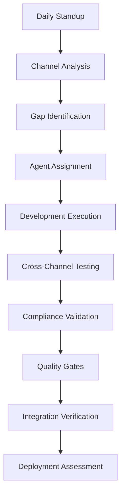

# Bancozim AI Agent Coordination System

🤖 **Multi-Agent Development Platform for Financial Services Application**

This system orchestrates 12 specialized AI agents working in coordinated harmony to build and maintain the Bancozim Application Portal - a multi-channel loan and financial services platform with enterprise-grade quality and regulatory compliance.

## 🎯 Overview

The Bancozim AI Agent Coordination Protocol manages multiple specialized AI agents to build a comprehensive financial services platform supporting Web, WhatsApp, USSD, and Mobile channels while maintaining Zimbabwe financial regulatory compliance.

### Key Features

- **12 Specialized AI Agents** working in coordinated hierarchy
- **Multi-Channel Development** coordination (Web, WhatsApp, USSD, Mobile)
- **Regulatory Compliance Scanner** for Zimbabwe financial requirements
- **Real-time Quality Monitoring** with Laravel/PHP standards
- **Cross-Platform State Management** validation
- **Automated Testing Orchestration** with Pest PHP
- **Daily Standup Coordination** for progress tracking

## 🏗️ Architecture

```
Master Coordinator
├── Development Agents
│   ├── Claude-DB (MySQL Schema & Migrations)
│   ├── Claude-Laravel (Backend Development)
│   ├── Claude-React (React/TypeScript Frontend)
│   ├── Claude-Filament (Admin Panel Development)
│   ├── Claude-Integration (WhatsApp/USSD/Twilio)
│   └── Claude-Test (Pest PHP Testing)
├── Quality Agents
│   ├── Claude-Security (OWASP & Financial Security)
│   ├── Claude-Performance (Redis/Cache Optimization)
│   └── Claude-Compliance (Zimbabwe Financial Regulations)
└── Business Agents
    ├── Claude-Business (Loan Products & Workflows)
    ├── Claude-UX (Multi-Language UI/UX)
    └── Claude-Docs (Technical & User Documentation)
```

## 🚀 Quick Start

### 1. Run Full Platform Analysis

```bash
# Complete platform assessment for Bancozim
php artisan ai:coordinate --command=full-scan

# Or using the Python coordinator
python scripts/ai-agents/coordinate_bancozim.py --command full-scan
```

### 2. Daily Development Standup

```bash
# Run daily standup coordination
php artisan ai:standup

# Check multi-channel integration status
php artisan ai:channels --status
```

### 3. Gap Analysis

```bash
# Identify implementation gaps across all channels
php artisan ai:gaps --channel=all

# Specific channel analysis
php artisan ai:gaps --channel=whatsapp
```

### 4. Quality Dashboard

```bash
# Generate Laravel/React quality metrics
php artisan ai:quality --export=html

# Pest PHP test coverage report
php artisan ai:test-coverage
```

### 5. Compliance Check

```bash
# Zimbabwe financial compliance assessment
php artisan ai:compliance --type=financial
```

## 📊 Available Commands

| Command | Description |
|---------|-------------|
| `ai:standup` | Daily agent coordination and sprint tracking |
| `ai:gaps` | Gap analysis across all platform channels |
| `ai:quality` | Laravel/React code quality metrics |
| `ai:compliance` | Zimbabwe regulatory compliance check |
| `ai:channels` | Multi-channel integration status |
| `ai:pdf-test` | PDF generation testing coordination |
| `ai:security` | OWASP and security audit |
| `ai:deploy` | Production deployment readiness |
| `ai:full-scan` | Complete platform assessment |

## 🎯 Agent Specializations

### Development Agents

- **Claude-DB**: 
  - MySQL 8.0 schema design
  - Migration strategies
  - Query optimization (60-80% improvement targets)
  - Index management for loan applications

- **Claude-Laravel**:
  - Laravel 12 API development
  - Service layer architecture
  - Queue job management (Redis)
  - Session state management across channels
  
- **Claude-React**:
  - React 18 with TypeScript
  - Inertia.js integration
  - Tailwind CSS 4.0 styling
  - Multi-language support (English, Shona, Ndebele)

- **Claude-Filament**:
  - Filament PHP 3.2 admin panel
  - Custom widgets development
  - Agent management interfaces
  - Commission tracking dashboards

- **Claude-Integration**:
  - Twilio WhatsApp Business API
  - USSD gateway integration
  - Cross-channel state persistence
  - OTP-based session linking

- **Claude-Test**:
  - Pest PHP unit testing (85%+ coverage)
  - Feature testing for multi-channel flows
  - PDF generation visual testing
  - API endpoint validation

### Quality Agents

- **Claude-Security**:
  - OWASP Top 10 compliance
  - PCI DSS readiness for payments
  - CSP headers implementation
  - Rate limiting and throttling

- **Claude-Performance**:
  - Redis cache optimization (90% hit rate)
  - Database query optimization
  - Page load < 3 seconds
  - API response < 500ms

- **Claude-Compliance**:
  - Zimbabwe financial regulations
  - KYC/AML requirements
  - Data protection compliance
  - Audit trail management

### Business Agents

- **Claude-Business**:
  - Loan product configuration
  - Commission structure design
  - Workflow optimization
  - Agent performance metrics

- **Claude-UX**:
  - Multi-language interface design
  - Mobile-responsive layouts
  - WCAG 2.1 AA accessibility
  - WhatsApp conversation flows

- **Claude-Docs**:
  - API documentation
  - User manuals (multi-language)
  - Admin guides
  - Integration documentation

## 📋 Directory Structure

```
scripts/ai-agents/
├── core/
│   ├── bancozim_coordinator.py     # Main coordination system
│   ├── channel_manager.py          # Multi-channel coordination
│   └── compliance_validator.py     # Zimbabwe compliance checks
├── monitors/
│   ├── laravel_quality.py          # Laravel code monitoring
│   ├── react_quality.py            # React/TypeScript monitoring
│   └── channel_health.py           # Channel integration health
├── analyzers/
│   ├── gap_analysis.py             # Implementation gaps
│   ├── pdf_testing.py              # PDF generation validation
│   └── security_audit.py           # Security assessment
├── templates/
│   ├── claude_laravel.md           # Laravel agent template
│   ├── claude_filament.md          # Filament agent template
│   ├── claude_react.md             # React agent template
│   └── claude_integration.md       # Integration agent template
├── configs/
│   ├── channels/                   # Channel-specific configs
│   ├── compliance/                 # Regulatory requirements
│   └── workflows/                  # Application workflows
├── reports/                         # Generated assessments
└── coordinate_bancozim.py          # Main orchestration script
```

## 🔄 Workflow Process

### 1. Multi-Channel Coordination Cycle



### 2. Channel-Specific Workflows

#### Web Application Flow
1. React component development
2. Inertia.js integration
3. Form validation and wizards
4. PDF generation testing

#### WhatsApp Integration Flow
1. Twilio webhook setup
2. Conversation state management
3. Session persistence
4. OTP linking implementation

#### USSD Channel Flow
1. Menu structure design
2. Session management
3. Timeout handling
4. Cross-channel handoff

## 📊 Quality Standards

### Laravel/PHP Standards
- **PSR-12** coding standards
- **Laravel best practices** adherence
- **Service pattern** implementation
- **Repository pattern** for data access
- **Queue jobs** for heavy operations

### Performance Requirements
- **API Response**: <500ms for 95% requests
- **PDF Generation**: <10 seconds
- **Database Queries**: 60-80% optimization
- **Cache Hit Rate**: >90%
- **Concurrent Users**: 1000+ support

### Security Standards
- **OWASP Top 10** compliance
- **CSP Headers** implementation
- **Rate Limiting** on all endpoints
- **Input Sanitization** for XSS/SQL injection
- **PCI DSS** ready for payment phase

### Testing Coverage
- **Backend (Pest PHP)**: 85%+ coverage
- **Frontend (Jest)**: 80%+ coverage
- **E2E Testing**: Critical user journeys
- **PDF Testing**: Visual regression tests

## 🔍 Monitoring & Reports

### Real-time Dashboards

#### Platform Health Dashboard
```bash
php artisan ai:dashboard --type=health
```
- Channel availability status
- Service health checks
- Queue job processing
- Error rate monitoring

#### Development Progress Dashboard
```bash
php artisan ai:dashboard --type=progress
```
- Feature completion tracking
- Test coverage trends
- Agent task assignments
- Sprint velocity metrics

### Generated Reports
- Daily standup summaries with channel status
- Gap analysis per channel and feature
- Compliance assessment reports
- Security audit findings
- Performance benchmarks
- Agent coordination logs

## 🛠️ Laravel Development Integration

### Artisan Commands
```bash
# Generate agent task from gap analysis
php artisan ai:make:task --from-gap

# Run specific agent
php artisan ai:agent:run Claude-Laravel --task=api-endpoints

# Validate channel integration
php artisan ai:validate:channel whatsapp

# Generate compliance report
php artisan ai:report:compliance --format=pdf
```

### Composer Integration
```json
{
  "scripts": {
    "ai-standup": "php artisan ai:standup",
    "ai-quality": "php artisan ai:quality",
    "ai-test": "php artisan ai:test-coverage",
    "ai-deploy-check": "php artisan ai:deploy --check"
  }
}
```

### CI/CD Pipeline Integration
```yaml
# .github/workflows/ai-coordination.yml
- name: AI Quality Check
  run: php artisan ai:quality --fail-on-low

- name: Compliance Validation
  run: php artisan ai:compliance --strict

- name: Multi-Channel Tests
  run: php artisan ai:channels --test-all
```

## 🚀 Deployment Readiness

### Production Criteria
- **Code Quality**: Laravel standards 85%+
- **Test Coverage**: Pest PHP 85%+
- **Security Scan**: No critical vulnerabilities
- **Performance**: All metrics within SLA
- **Documentation**: Complete for all channels
- **Compliance**: Zimbabwe regulations passed
- **Infrastructure**: Docker/Kubernetes ready

### Deployment Checklist
```bash
# Run full deployment assessment
php artisan ai:deploy --checklist

# Outputs:
✅ Laravel application configured
✅ MySQL database optimized
✅ Redis cache configured
✅ Queue workers ready
✅ WhatsApp webhooks active
✅ PDF generation tested
✅ Security headers implemented
✅ Compliance requirements met
```

## 🔧 Troubleshooting

### Common Issues

**WhatsApp Session State Issues**
```bash
php artisan ai:debug:channel whatsapp --session
```

**PDF Generation Failures**
```bash
php artisan ai:debug:pdf --test-all-forms
```

**Cross-Channel State Sync**
```bash
php artisan ai:debug:state --channel=all
```

**Filament Admin Issues**
```bash
php artisan ai:debug:filament --widgets
```

### Logging
- Agent logs: `storage/logs/ai-agents/`
- Channel logs: `storage/logs/channels/`
- Compliance logs: `storage/logs/compliance/`
- Performance metrics: `storage/logs/performance/`

## 📈 Enterprise Features

### Financial Services Readiness
- Complete regulatory compliance tracking
- Audit trail generation for all transactions
- KYC/AML workflow validation
- Commission calculation verification

### Multi-Channel Architecture
- Unified state management across channels
- Session persistence and recovery
- Channel-specific optimization
- Seamless handoff protocols

### Scalability Design
- Horizontal scaling with Laravel Horizon
- Redis cluster support
- MySQL read replicas
- CDN integration for assets

## 🤝 Phase Implementation

### Phase 1 (Current)
- Web application (React + Laravel)
- WhatsApp integration (Twilio)
- Admin panel (Filament)
- PDF generation system

### Phase 2 (Q1 2025)
- USSD channel implementation
- Mobile app development
- Advanced analytics
- Fraud detection system

### Phase 3 (Q2 2025)
- Payment gateway integration
- Automated disbursement
- Collections management
- Customer portal

### Phase 4 (Q3 2025)
- AI-powered chatbot
- Predictive analytics
- Multi-currency support
- Partner APIs

---

**Built for Bancozim Application Portal - Multi-Channel Financial Services Platform**

*This coordination system ensures enterprise-grade quality, regulatory compliance, and seamless multi-channel integration for Zimbabwe's financial services sector.*